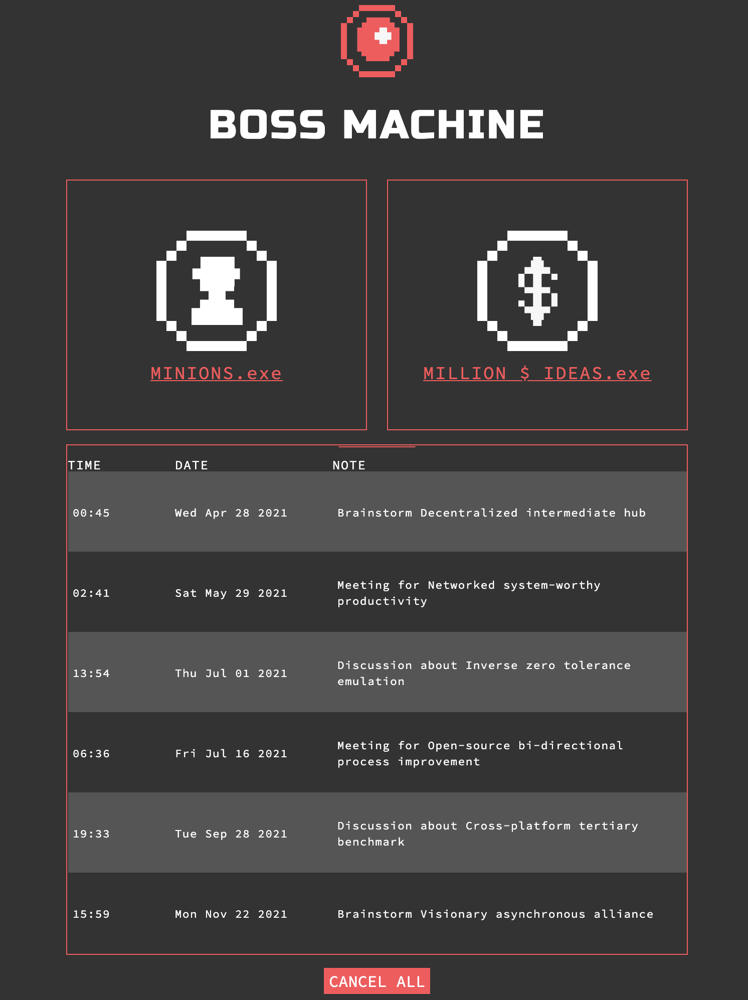

# Boss Machine

## Project Overview

In this project, the goal is to create an entire API to serve information to a "Boss Machine". It will create routes to manage the 'minions', the 'million dollar ideas', and to handle all the meetings.

#### Routes

- `/api/minions`
  - GET /api/minions to get an array of all minions.
  - POST /api/minions to create a new minion and save it to the database.
  - GET /api/minions/:minionId to get a single minion by id.
  - PUT /api/minions/:minionId to update a single minion by id.
  - DELETE /api/minions/:minionId to delete a single minion by id.
- `/api/ideas`
  - GET /api/ideas to get an array of all ideas.
  - POST /api/ideas to create a new idea and save it to the database.
  - GET /api/ideas/:ideaId to get a single idea by id.
  - PUT /api/ideas/:ideaId to update a single idea by id.
  - DELETE /api/ideas/:ideaId to delete a single idea by id.
- `/api/meetings`
  - GET /api/meetings to get an array of all meetings.
  - POST /api/meetings to create a new meeting and save it to the database.
  - DELETE /api/meetings to delete _all_ meetings from the database.
- `/api/:minionId/work`
  - GET /api/minions/:minionId/work to get an array of all work for the specified minon.
  - POST /api/minions/:minionId/work to create a new work object and save it to the database.
  - PUT /api/minions/:minionId/work/:workId to update a single work by id.
  - DELETE /api/minions/:minionId/work/:workId to delete a single work by id.

This project is part of the FullStack Path on Codecademy. The HTML boilerplate and CSS had been provided to me.
